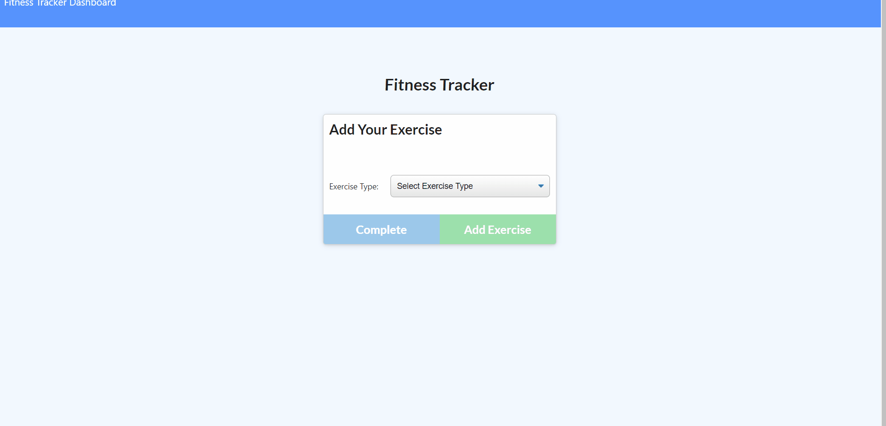

# FitnessTracker

## Description
This app helps users to view, create and track daily workouts. The user is able to log multiple exercises in a workout on a given day. They are also able to track the name, type, weight, sets, reps, and duration of exercise. If the exercise is a cardio exercise, they are also able to track the distance traveled. This app also has a stats page to give the viewer several different viewing options in charts and graphs so they can track their workouts over the week. 

## Usage
This application is meant to be an easy way for a user to track their physical fitness daily. From a business context, a consumer will reach their fitness goals quicker when they are able to track their workout progress. 

## Heroku Deployment Link:

  
### Liscense

MIT License

Copyright (c) [2019] [Sydney Preston]

Permission is hereby granted, free of charge, to any person obtaining a copy
of this software and associated documentation files (the "Software"), to deal
in the Software without restriction, including without limitation the rights
to use, copy, modify, merge, publish, distribute, sublicense, and/or sell
copies of the Software, and to permit persons to whom the Software is
furnished to do so, subject to the following conditions:

The above copyright notice and this permission notice shall be included in all
copies or substantial portions of the Software.

THE SOFTWARE IS PROVIDED "AS IS", WITHOUT WARRANTY OF ANY KIND, EXPRESS OR
IMPLIED, INCLUDING BUT NOT LIMITED TO THE WARRANTIES OF MERCHANTABILITY,
FITNESS FOR A PARTICULAR PURPOSE AND NONINFRINGEMENT. IN NO EVENT SHALL THE
AUTHORS OR COPYRIGHT HOLDERS BE LIABLE FOR ANY CLAIM, DAMAGES OR OTHER
LIABILITY, WHETHER IN AN ACTION OF CONTRACT, TORT OR OTHERWISE, ARISING FROM,
OUT OF OR IN CONNECTION WITH THE SOFTWARE OR THE USE OR OTHER DEALINGS IN THE
SOFTWARE.
